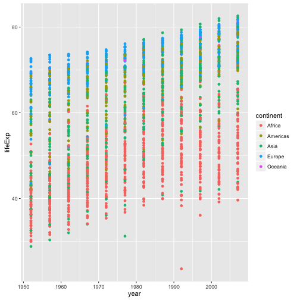

## Gapminder Data Analysis

Gapminder is a great set of data for analyzing how GDP might affect the life expectancy of people in different countries and continents.  For example, in countries in Africa with extremely low GDPs the life expectancy is also extremely low.  In addition, certain events can cause a sudden decrease in life expectancy such as war or disease.  In fact, one of the biggest changes in life expectancy was the AIDS virus.  It would be useful to look at the change in life expectancies over the years to see the general trend.


```r
library(plyr)
get(gapminder)
```

```
## Error in get(gapminder): invalid first argument
```

```r
daply(.data=gapminder,.variables=c("country","year"),.fun=function(x) mean(x$lifeExp))
```

```
##                           year
## country                      1952     1957     1962     1967     1972
##   Afghanistan              28.801 30.33200 31.99700 34.02000 36.08800
##   Albania                  55.230 59.28000 64.82000 66.22000 67.69000
##   Algeria                  43.077 45.68500 48.30300 51.40700 54.51800
##   Angola                   30.015 31.99900 34.00000 35.98500 37.92800
##   Argentina                62.485 64.39900 65.14200 65.63400 67.06500
##   Australia                69.120 70.33000 70.93000 71.10000 71.93000
##   Austria                  66.800 67.48000 69.54000 70.14000 70.63000
##   Bahrain                  50.939 53.83200 56.92300 59.92300 63.30000
##   Bangladesh               37.484 39.34800 41.21600 43.45300 45.25200
##   Belgium                  68.000 69.24000 70.25000 70.94000 71.44000
##   Benin                    38.223 40.35800 42.61800 44.88500 47.01400
##   Bolivia                  40.414 41.89000 43.42800 45.03200 46.71400
##   Bosnia and Herzegovina   53.820 58.45000 61.93000 64.79000 67.45000
##   Botswana                 47.622 49.61800 51.52000 53.29800 56.02400
##   Brazil                   50.917 53.28500 55.66500 57.63200 59.50400
##   Bulgaria                 59.600 66.61000 69.51000 70.42000 70.90000
##   Burkina Faso             31.975 34.90600 37.81400 40.69700 43.59100
##   Burundi                  39.031 40.53300 42.04500 43.54800 44.05700
##   Cambodia                 39.417 41.36600 43.41500 45.41500 40.31700
##   Cameroon                 38.523 40.42800 42.64300 44.79900 47.04900
##   Canada                   68.750 69.96000 71.30000 72.13000 72.88000
##   Central African Republic 35.463 37.46400 39.47500 41.47800 43.45700
##   Chad                     38.092 39.88100 41.71600 43.60100 45.56900
##   Chile                    54.745 56.07400 57.92400 60.52300 63.44100
##   China                    44.000 50.54896 44.50136 58.38112 63.11888
##   Colombia                 50.643 55.11800 57.86300 59.96300 61.62300
##   Comoros                  40.715 42.46000 44.46700 46.47200 48.94400
##   Congo Dem. Rep.          39.143 40.65200 42.12200 44.05600 45.98900
##   Congo Rep.               42.111 45.05300 48.43500 52.04000 54.90700
##   Costa Rica               57.206 60.02600 62.84200 65.42400 67.84900
##   Cote d'Ivoire            40.477 42.46900 44.93000 47.35000 49.80100
##   Croatia                  61.210 64.77000 67.13000 68.50000 69.61000
##   Cuba                     59.421 62.32500 65.24600 68.29000 70.72300
##   Czech Republic           66.870 69.03000 69.90000 70.38000 70.29000
##   Denmark                  70.780 71.81000 72.35000 72.96000 73.47000
##   Djibouti                 34.812 37.32800 39.69300 42.07400 44.36600
##   Dominican Republic       45.928 49.82800 53.45900 56.75100 59.63100
##   Ecuador                  48.357 51.35600 54.64000 56.67800 58.79600
##   Egypt                    41.893 44.44400 46.99200 49.29300 51.13700
##   El Salvador              45.262 48.57000 52.30700 55.85500 58.20700
##   Equatorial Guinea        34.482 35.98300 37.48500 38.98700 40.51600
##   Eritrea                  35.928 38.04700 40.15800 42.18900 44.14200
##   Ethiopia                 34.078 36.66700 40.05900 42.11500 43.51500
##   Finland                  66.550 67.49000 68.75000 69.83000 70.87000
##   France                   67.410 68.93000 70.51000 71.55000 72.38000
##   Gabon                    37.003 38.99900 40.48900 44.59800 48.69000
##   Gambia                   30.000 32.06500 33.89600 35.85700 38.30800
##   Germany                  67.500 69.10000 70.30000 70.80000 71.00000
##   Ghana                    43.149 44.77900 46.45200 48.07200 49.87500
##   Greece                   65.860 67.86000 69.51000 71.00000 72.34000
##   Guatemala                42.023 44.14200 46.95400 50.01600 53.73800
##   Guinea                   33.609 34.55800 35.75300 37.19700 38.84200
##   Guinea-Bissau            32.500 33.48900 34.48800 35.49200 36.48600
##   Haiti                    37.579 40.69600 43.59000 46.24300 48.04200
##   Honduras                 41.912 44.66500 48.04100 50.92400 53.88400
##   Hong Kong China          60.960 64.75000 67.65000 70.00000 72.00000
##   Hungary                  64.030 66.41000 67.96000 69.50000 69.76000
##   Iceland                  72.490 73.47000 73.68000 73.73000 74.46000
##   India                    37.373 40.24900 43.60500 47.19300 50.65100
##   Indonesia                37.468 39.91800 42.51800 45.96400 49.20300
##   Iran                     44.869 47.18100 49.32500 52.46900 55.23400
##   Iraq                     45.320 48.43700 51.45700 54.45900 56.95000
##   Ireland                  66.910 68.90000 70.29000 71.08000 71.28000
##   Israel                   65.390 67.84000 69.39000 70.75000 71.63000
##   Italy                    65.940 67.81000 69.24000 71.06000 72.19000
##   Jamaica                  58.530 62.61000 65.61000 67.51000 69.00000
##   Japan                    63.030 65.50000 68.73000 71.43000 73.42000
##   Jordan                   43.158 45.66900 48.12600 51.62900 56.52800
##   Kenya                    42.270 44.68600 47.94900 50.65400 53.55900
##   Korea Dem. Rep.          50.056 54.08100 56.65600 59.94200 63.98300
##   Korea Rep.               47.453 52.68100 55.29200 57.71600 62.61200
##   Kuwait                   55.565 58.03300 60.47000 64.62400 67.71200
##   Lebanon                  55.928 59.48900 62.09400 63.87000 65.42100
##   Lesotho                  42.138 45.04700 47.74700 48.49200 49.76700
##   Liberia                  38.480 39.48600 40.50200 41.53600 42.61400
##   Libya                    42.723 45.28900 47.80800 50.22700 52.77300
##   Madagascar               36.681 38.86500 40.84800 42.88100 44.85100
##   Malawi                   36.256 37.20700 38.41000 39.48700 41.76600
##   Malaysia                 48.463 52.10200 55.73700 59.37100 63.01000
##   Mali                     33.685 35.30700 36.93600 38.48700 39.97700
##   Mauritania               40.543 42.33800 44.24800 46.28900 48.43700
##   Mauritius                50.986 58.08900 60.24600 61.55700 62.94400
##   Mexico                   50.789 55.19000 58.29900 60.11000 62.36100
##   Mongolia                 42.244 45.24800 48.25100 51.25300 53.75400
##   Montenegro               59.164 61.44800 63.72800 67.17800 70.63600
##   Morocco                  42.873 45.42300 47.92400 50.33500 52.86200
##   Mozambique               31.286 33.77900 36.16100 38.11300 40.32800
##   Myanmar                  36.319 41.90500 45.10800 49.37900 53.07000
##   Namibia                  41.725 45.22600 48.38600 51.15900 53.86700
##   Nepal                    36.157 37.68600 39.39300 41.47200 43.97100
##   Netherlands              72.130 72.99000 73.23000 73.82000 73.75000
##   New Zealand              69.390 70.26000 71.24000 71.52000 71.89000
##   Nicaragua                42.314 45.43200 48.63200 51.88400 55.15100
##   Niger                    37.444 38.59800 39.48700 40.11800 40.54600
##   Nigeria                  36.324 37.80200 39.36000 41.04000 42.82100
##   Norway                   72.670 73.44000 73.47000 74.08000 74.34000
##   Oman                     37.578 40.08000 43.16500 46.98800 52.14300
##   Pakistan                 43.436 45.55700 47.67000 49.80000 51.92900
##   Panama                   55.191 59.20100 61.81700 64.07100 66.21600
##   Paraguay                 62.649 63.19600 64.36100 64.95100 65.81500
##   Peru                     43.902 46.26300 49.09600 51.44500 55.44800
##   Philippines              47.752 51.33400 54.75700 56.39300 58.06500
##   Poland                   61.310 65.77000 67.64000 69.61000 70.85000
##   Portugal                 59.820 61.51000 64.39000 66.60000 69.26000
##   Puerto Rico              64.280 68.54000 69.62000 71.10000 72.16000
##   Reunion                  52.724 55.09000 57.66600 60.54200 64.27400
##   Romania                  61.050 64.10000 66.80000 66.80000 69.21000
##   Rwanda                   40.000 41.50000 43.00000 44.10000 44.60000
##   Sao Tome and Principe    46.471 48.94500 51.89300 54.42500 56.48000
##   Saudi Arabia             39.875 42.86800 45.91400 49.90100 53.88600
##   Senegal                  37.278 39.32900 41.45400 43.56300 45.81500
##   Serbia                   57.996 61.68500 64.53100 66.91400 68.70000
##   Sierra Leone             30.331 31.57000 32.76700 34.11300 35.40000
##   Singapore                60.396 63.17900 65.79800 67.94600 69.52100
##   Slovak Republic          64.360 67.45000 70.33000 70.98000 70.35000
##   Slovenia                 65.570 67.85000 69.15000 69.18000 69.82000
##   Somalia                  32.978 34.97700 36.98100 38.97700 40.97300
##   South Africa             45.009 47.98500 49.95100 51.92700 53.69600
##   Spain                    64.940 66.66000 69.69000 71.44000 73.06000
##   Sri Lanka                57.593 61.45600 62.19200 64.26600 65.04200
##   Sudan                    38.635 39.62400 40.87000 42.85800 45.08300
##   Swaziland                41.407 43.42400 44.99200 46.63300 49.55200
##   Sweden                   71.860 72.49000 73.37000 74.16000 74.72000
##   Switzerland              69.620 70.56000 71.32000 72.77000 73.78000
##   Syria                    45.883 48.28400 50.30500 53.65500 57.29600
##   Taiwan                   58.500 62.40000 65.20000 67.50000 69.39000
##   Tanzania                 41.215 42.97400 44.24600 45.75700 47.62000
##   Thailand                 50.848 53.63000 56.06100 58.28500 60.40500
##   Togo                     38.596 41.20800 43.92200 46.76900 49.75900
##   Trinidad and Tobago      59.100 61.80000 64.90000 65.40000 65.90000
##   Tunisia                  44.600 47.10000 49.57900 52.05300 55.60200
##   Turkey                   43.585 48.07900 52.09800 54.33600 57.00500
##   Uganda                   39.978 42.57100 45.34400 48.05100 51.01600
##   United Kingdom           69.180 70.42000 70.76000 71.36000 72.01000
##   United States            68.440 69.49000 70.21000 70.76000 71.34000
##   Uruguay                  66.071 67.04400 68.25300 68.46800 68.67300
##   Venezuela                55.088 57.90700 60.77000 63.47900 65.71200
##   Vietnam                  40.412 42.88700 45.36300 47.83800 50.25400
##   West Bank and Gaza       43.160 45.67100 48.12700 51.63100 56.53200
##   Yemen Rep.               32.548 33.97000 35.18000 36.98400 39.84800
##   Zambia                   42.038 44.07700 46.02300 47.76800 50.10700
##   Zimbabwe                 48.451 50.46900 52.35800 53.99500 55.63500
##                           year
## country                        1977   1982   1987   1992   1997   2002
##   Afghanistan              38.43800 39.854 40.822 41.674 41.763 42.129
##   Albania                  68.93000 70.420 72.000 71.581 72.950 75.651
##   Algeria                  58.01400 61.368 65.799 67.744 69.152 70.994
##   Angola                   39.48300 39.942 39.906 40.647 40.963 41.003
##   Argentina                68.48100 69.942 70.774 71.868 73.275 74.340
##   Australia                73.49000 74.740 76.320 77.560 78.830 80.370
##   Austria                  72.17000 73.180 74.940 76.040 77.510 78.980
##   Bahrain                  65.59300 69.052 70.750 72.601 73.925 74.795
##   Bangladesh               46.92300 50.009 52.819 56.018 59.412 62.013
##   Belgium                  72.80000 73.930 75.350 76.460 77.530 78.320
##   Benin                    49.19000 50.904 52.337 53.919 54.777 54.406
##   Bolivia                  50.02300 53.859 57.251 59.957 62.050 63.883
##   Bosnia and Herzegovina   69.86000 70.690 71.140 72.178 73.244 74.090
##   Botswana                 59.31900 61.484 63.622 62.745 52.556 46.634
##   Brazil                   61.48900 63.336 65.205 67.057 69.388 71.006
##   Bulgaria                 70.81000 71.080 71.340 71.190 70.320 72.140
##   Burkina Faso             46.13700 48.122 49.557 50.260 50.324 50.650
##   Burundi                  45.91000 47.471 48.211 44.736 45.326 47.360
##   Cambodia                 31.22000 50.957 53.914 55.803 56.534 56.752
##   Cameroon                 49.35500 52.961 54.985 54.314 52.199 49.856
##   Canada                   74.21000 75.760 76.860 77.950 78.610 79.770
##   Central African Republic 46.77500 48.295 50.485 49.396 46.066 43.308
##   Chad                     47.38300 49.517 51.051 51.724 51.573 50.525
##   Chile                    67.05200 70.565 72.492 74.126 75.816 77.860
##   China                    63.96736 65.525 67.274 68.690 70.426 72.028
##   Colombia                 63.83700 66.653 67.768 68.421 70.313 71.682
##   Comoros                  50.93900 52.933 54.926 57.939 60.660 62.974
##   Congo Dem. Rep.          47.80400 47.784 47.412 45.548 42.587 44.966
##   Congo Rep.               55.62500 56.695 57.470 56.433 52.962 52.970
##   Costa Rica               70.75000 73.450 74.752 75.713 77.260 78.123
##   Cote d'Ivoire            52.37400 53.983 54.655 52.044 47.991 46.832
##   Croatia                  70.64000 70.460 71.520 72.527 73.680 74.876
##   Cuba                     72.64900 73.717 74.174 74.414 76.151 77.158
##   Czech Republic           70.71000 70.960 71.580 72.400 74.010 75.510
##   Denmark                  74.69000 74.630 74.800 75.330 76.110 77.180
##   Djibouti                 46.51900 48.812 50.040 51.604 53.157 53.373
##   Dominican Republic       61.78800 63.727 66.046 68.457 69.957 70.847
##   Ecuador                  61.31000 64.342 67.231 69.613 72.312 74.173
##   Egypt                    53.31900 56.006 59.797 63.674 67.217 69.806
##   El Salvador              56.69600 56.604 63.154 66.798 69.535 70.734
##   Equatorial Guinea        42.02400 43.662 45.664 47.545 48.245 49.348
##   Eritrea                  44.53500 43.890 46.453 49.991 53.378 55.240
##   Ethiopia                 44.51000 44.916 46.684 48.091 49.402 50.725
##   Finland                  72.52000 74.550 74.830 75.700 77.130 78.370
##   France                   73.83000 74.890 76.340 77.460 78.640 79.590
##   Gabon                    52.79000 56.564 60.190 61.366 60.461 56.761
##   Gambia                   41.84200 45.580 49.265 52.644 55.861 58.041
##   Germany                  72.50000 73.800 74.847 76.070 77.340 78.670
##   Ghana                    51.75600 53.744 55.729 57.501 58.556 58.453
##   Greece                   73.68000 75.240 76.670 77.030 77.869 78.256
##   Guatemala                56.02900 58.137 60.782 63.373 66.322 68.978
##   Guinea                   40.76200 42.891 45.552 48.576 51.455 53.676
##   Guinea-Bissau            37.46500 39.327 41.245 43.266 44.873 45.504
##   Haiti                    49.92300 51.461 53.636 55.089 56.671 58.137
##   Honduras                 57.40200 60.909 64.492 66.399 67.659 68.565
##   Hong Kong China          73.60000 75.450 76.200 77.601 80.000 81.495
##   Hungary                  69.95000 69.390 69.580 69.170 71.040 72.590
##   Iceland                  76.11000 76.990 77.230 78.770 78.950 80.500
##   India                    54.20800 56.596 58.553 60.223 61.765 62.879
##   Indonesia                52.70200 56.159 60.137 62.681 66.041 68.588
##   Iran                     57.70200 59.620 63.040 65.742 68.042 69.451
##   Iraq                     60.41300 62.038 65.044 59.461 58.811 57.046
##   Ireland                  72.03000 73.100 74.360 75.467 76.122 77.783
##   Israel                   73.06000 74.450 75.600 76.930 78.269 79.696
##   Italy                    73.48000 74.980 76.420 77.440 78.820 80.240
##   Jamaica                  70.11000 71.210 71.770 71.766 72.262 72.047
##   Japan                    75.38000 77.110 78.670 79.360 80.690 82.000
##   Jordan                   61.13400 63.739 65.869 68.015 69.772 71.263
##   Kenya                    56.15500 58.766 59.339 59.285 54.407 50.992
##   Korea Dem. Rep.          67.15900 69.100 70.647 69.978 67.727 66.662
##   Korea Rep.               64.76600 67.123 69.810 72.244 74.647 77.045
##   Kuwait                   69.34300 71.309 74.174 75.190 76.156 76.904
##   Lebanon                  66.09900 66.983 67.926 69.292 70.265 71.028
##   Lesotho                  52.20800 55.078 57.180 59.685 55.558 44.593
##   Liberia                  43.76400 44.852 46.027 40.802 42.221 43.753
##   Libya                    57.44200 62.155 66.234 68.755 71.555 72.737
##   Madagascar               46.88100 48.969 49.350 52.214 54.978 57.286
##   Malawi                   43.76700 45.642 47.457 49.420 47.495 45.009
##   Malaysia                 65.25600 68.000 69.500 70.693 71.938 73.044
##   Mali                     41.71400 43.916 46.364 48.388 49.903 51.818
##   Mauritania               50.85200 53.599 56.145 58.333 60.430 62.247
##   Mauritius                64.93000 66.711 68.740 69.745 70.736 71.954
##   Mexico                   65.03200 67.405 69.498 71.455 73.670 74.902
##   Mongolia                 55.49100 57.489 60.222 61.271 63.625 65.033
##   Montenegro               73.06600 74.101 74.865 75.435 75.445 73.981
##   Morocco                  55.73000 59.650 62.677 65.393 67.660 69.615
##   Mozambique               42.49500 42.795 42.861 44.284 46.344 44.026
##   Myanmar                  56.05900 58.056 58.339 59.320 60.328 59.908
##   Namibia                  56.43700 58.968 60.835 61.999 58.909 51.479
##   Nepal                    46.74800 49.594 52.537 55.727 59.426 61.340
##   Netherlands              75.24000 76.050 76.830 77.420 78.030 78.530
##   New Zealand              72.22000 73.840 74.320 76.330 77.550 79.110
##   Nicaragua                57.47000 59.298 62.008 65.843 68.426 70.836
##   Niger                    41.29100 42.598 44.555 47.391 51.313 54.496
##   Nigeria                  44.51400 45.826 46.886 47.472 47.464 46.608
##   Norway                   75.37000 75.970 75.890 77.320 78.320 79.050
##   Oman                     57.36700 62.728 67.734 71.197 72.499 74.193
##   Pakistan                 54.04300 56.158 58.245 60.838 61.818 63.610
##   Panama                   68.68100 70.472 71.523 72.462 73.738 74.712
##   Paraguay                 66.35300 66.874 67.378 68.225 69.400 70.755
##   Peru                     58.44700 61.406 64.134 66.458 68.386 69.906
##   Philippines              60.06000 62.082 64.151 66.458 68.564 70.303
##   Poland                   70.67000 71.320 70.980 70.990 72.750 74.670
##   Portugal                 70.41000 72.770 74.060 74.860 75.970 77.290
##   Puerto Rico              73.44000 73.750 74.630 73.911 74.917 77.778
##   Reunion                  67.06400 69.885 71.913 73.615 74.772 75.744
##   Romania                  69.46000 69.660 69.530 69.360 69.720 71.322
##   Rwanda                   45.00000 46.218 44.020 23.599 36.087 43.413
##   Sao Tome and Principe    58.55000 60.351 61.728 62.742 63.306 64.337
##   Saudi Arabia             58.69000 63.012 66.295 68.768 70.533 71.626
##   Senegal                  48.87900 52.379 55.769 58.196 60.187 61.600
##   Serbia                   70.30000 70.162 71.218 71.659 72.232 73.213
##   Sierra Leone             36.78800 38.445 40.006 38.333 39.897 41.012
##   Singapore                70.79500 71.760 73.560 75.788 77.158 78.770
##   Slovak Republic          70.45000 70.800 71.080 71.380 72.710 73.800
##   Slovenia                 70.97000 71.063 72.250 73.640 75.130 76.660
##   Somalia                  41.97400 42.955 44.501 39.658 43.795 45.936
##   South Africa             55.52700 58.161 60.834 61.888 60.236 53.365
##   Spain                    74.39000 76.300 76.900 77.570 78.770 79.780
##   Sri Lanka                65.94900 68.757 69.011 70.379 70.457 70.815
##   Sudan                    47.80000 50.338 51.744 53.556 55.373 56.369
##   Swaziland                52.53700 55.561 57.678 58.474 54.289 43.869
##   Sweden                   75.44000 76.420 77.190 78.160 79.390 80.040
##   Switzerland              75.39000 76.210 77.410 78.030 79.370 80.620
##   Syria                    61.19500 64.590 66.974 69.249 71.527 73.053
##   Taiwan                   70.59000 72.160 73.400 74.260 75.250 76.990
##   Tanzania                 49.91900 50.608 51.535 50.440 48.466 49.651
##   Thailand                 62.49400 64.597 66.084 67.298 67.521 68.564
##   Togo                     52.88700 55.471 56.941 58.061 58.390 57.561
##   Trinidad and Tobago      68.30000 68.832 69.582 69.862 69.465 68.976
##   Tunisia                  59.83700 64.048 66.894 70.001 71.973 73.042
##   Turkey                   59.50700 61.036 63.108 66.146 68.835 70.845
##   Uganda                   50.35000 49.849 51.509 48.825 44.578 47.813
##   United Kingdom           72.76000 74.040 75.007 76.420 77.218 78.471
##   United States            73.38000 74.650 75.020 76.090 76.810 77.310
##   Uruguay                  69.48100 70.805 71.918 72.752 74.223 75.307
##   Venezuela                67.45600 68.557 70.190 71.150 72.146 72.766
##   Vietnam                  55.76400 58.816 62.820 67.662 70.672 73.017
##   West Bank and Gaza       60.76500 64.406 67.046 69.718 71.096 72.370
##   Yemen Rep.               44.17500 49.113 52.922 55.599 58.020 60.308
##   Zambia                   51.38600 51.821 50.821 46.100 40.238 39.193
##   Zimbabwe                 57.67400 60.363 62.351 60.377 46.809 39.989
##                           year
## country                      2007
##   Afghanistan              43.828
##   Albania                  76.423
##   Algeria                  72.301
##   Angola                   42.731
##   Argentina                75.320
##   Australia                81.235
##   Austria                  79.829
##   Bahrain                  75.635
##   Bangladesh               64.062
##   Belgium                  79.441
##   Benin                    56.728
##   Bolivia                  65.554
##   Bosnia and Herzegovina   74.852
##   Botswana                 50.728
##   Brazil                   72.390
##   Bulgaria                 73.005
##   Burkina Faso             52.295
##   Burundi                  49.580
##   Cambodia                 59.723
##   Cameroon                 50.430
##   Canada                   80.653
##   Central African Republic 44.741
##   Chad                     50.651
##   Chile                    78.553
##   China                    72.961
##   Colombia                 72.889
##   Comoros                  65.152
##   Congo Dem. Rep.          46.462
##   Congo Rep.               55.322
##   Costa Rica               78.782
##   Cote d'Ivoire            48.328
##   Croatia                  75.748
##   Cuba                     78.273
##   Czech Republic           76.486
##   Denmark                  78.332
##   Djibouti                 54.791
##   Dominican Republic       72.235
##   Ecuador                  74.994
##   Egypt                    71.338
##   El Salvador              71.878
##   Equatorial Guinea        51.579
##   Eritrea                  58.040
##   Ethiopia                 52.947
##   Finland                  79.313
##   France                   80.657
##   Gabon                    56.735
##   Gambia                   59.448
##   Germany                  79.406
##   Ghana                    60.022
##   Greece                   79.483
##   Guatemala                70.259
##   Guinea                   56.007
##   Guinea-Bissau            46.388
##   Haiti                    60.916
##   Honduras                 70.198
##   Hong Kong China          82.208
##   Hungary                  73.338
##   Iceland                  81.757
##   India                    64.698
##   Indonesia                70.650
##   Iran                     70.964
##   Iraq                     59.545
##   Ireland                  78.885
##   Israel                   80.745
##   Italy                    80.546
##   Jamaica                  72.567
##   Japan                    82.603
##   Jordan                   72.535
##   Kenya                    54.110
##   Korea Dem. Rep.          67.297
##   Korea Rep.               78.623
##   Kuwait                   77.588
##   Lebanon                  71.993
##   Lesotho                  42.592
##   Liberia                  45.678
##   Libya                    73.952
##   Madagascar               59.443
##   Malawi                   48.303
##   Malaysia                 74.241
##   Mali                     54.467
##   Mauritania               64.164
##   Mauritius                72.801
##   Mexico                   76.195
##   Mongolia                 66.803
##   Montenegro               74.543
##   Morocco                  71.164
##   Mozambique               42.082
##   Myanmar                  62.069
##   Namibia                  52.906
##   Nepal                    63.785
##   Netherlands              79.762
##   New Zealand              80.204
##   Nicaragua                72.899
##   Niger                    56.867
##   Nigeria                  46.859
##   Norway                   80.196
##   Oman                     75.640
##   Pakistan                 65.483
##   Panama                   75.537
##   Paraguay                 71.752
##   Peru                     71.421
##   Philippines              71.688
##   Poland                   75.563
##   Portugal                 78.098
##   Puerto Rico              78.746
##   Reunion                  76.442
##   Romania                  72.476
##   Rwanda                   46.242
##   Sao Tome and Principe    65.528
##   Saudi Arabia             72.777
##   Senegal                  63.062
##   Serbia                   74.002
##   Sierra Leone             42.568
##   Singapore                79.972
##   Slovak Republic          74.663
##   Slovenia                 77.926
##   Somalia                  48.159
##   South Africa             49.339
##   Spain                    80.941
##   Sri Lanka                72.396
##   Sudan                    58.556
##   Swaziland                39.613
##   Sweden                   80.884
##   Switzerland              81.701
##   Syria                    74.143
##   Taiwan                   78.400
##   Tanzania                 52.517
##   Thailand                 70.616
##   Togo                     58.420
##   Trinidad and Tobago      69.819
##   Tunisia                  73.923
##   Turkey                   71.777
##   Uganda                   51.542
##   United Kingdom           79.425
##   United States            78.242
##   Uruguay                  76.384
##   Venezuela                73.747
##   Vietnam                  74.249
##   West Bank and Gaza       73.422
##   Yemen Rep.               62.698
##   Zambia                   42.384
##   Zimbabwe                 43.487
```

We can also look at the life expectancies in each continent.  


```r
library(plyr)
daply(.data=gapminder,.variables=c("continent","year"),.fun=function(x) mean(x$lifeExp))
```

```
##           year
## continent      1952     1957     1962     1967     1972     1977     1982
##   Africa   39.13550 41.26635 43.31944 45.33454 47.45094 49.58042 51.59287
##   Americas 53.27984 55.96028 58.39876 60.41092 62.39492 64.39156 66.22884
##   Asia     46.31439 49.31854 51.56322 54.66364 57.31927 59.61056 62.61794
##   Europe   64.40850 66.70307 68.53923 69.73760 70.77503 71.93777 72.80640
##   Oceania  69.25500 70.29500 71.08500 71.31000 71.91000 72.85500 74.29000
##           year
## continent      1987     1992     1997     2002     2007
##   Africa   53.34479 53.62958 53.59827 53.32523 54.80604
##   Americas 68.09072 69.56836 71.15048 72.42204 73.60812
##   Asia     64.85118 66.53721 68.02052 69.23388 70.72848
##   Europe   73.64217 74.44010 75.50517 76.70060 77.64860
##   Oceania  75.32000 76.94500 78.19000 79.74000 80.71950
```

In Africa, the life expectancy change sharply decreased from 1982 and onwards which shows just how much factors such as war and disease can have on life expectancy.  We can plot this as well.  



